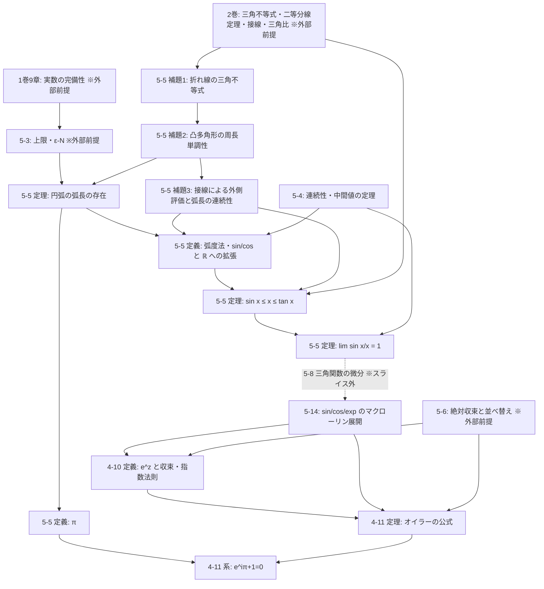

# PROOF_SKELETON ── 背骨垂直スライス監査(5巻5章・4巻11章)

対象: `原稿/5巻/05_弧長とπ.md`(主監査)・`原稿/4巻/11_オイラーの公式と等式.md`(主監査)。
参照ソース: 原稿の他6章(2-7, 4-7, 4-9, 4-10, 5-4, 5-14)。ハッシュは PROOF_AUDIT.md に記載。

## 1. 依存DAG(ノード=主要な主張、辺=uses)

閉路検出: なし(構文・意味とも)。5-8(三角関数の微分)はスライス未執筆の中間ノードで、5-14 が依存を宣言済み(5-14 依存台帳「8章」)。

## 2. 仮定台帳(主監査2章)

| 適用箇所 | 使用する結果 | 討伐地(claimed discharge) | 状態 |
|---|---|---|---|
| 5-5 補題1 | 三角不等式 | 2巻(既刊扱い) | 外部前提 |
| 5-5 定理(存在) | 上限の存在(完備性) | 1巻9章 / 5-3 | 外部前提 |
| 5-5 §4 P(x)の存在 | 弧長関数の連続性 | 同章§2 補題3の系(P(x)に依存しない幾何評価) | 討伐済み(R2で修復) |
| 5-5 §4 一般角への拡張 | 合同不変性・加法性・鏡映 | 同章§2(性質リスト)・§4末尾 | 討伐済み(R2で修復) |
| 5-5 §4 P(x)の一意性 | 中間値の定理・狭義単調性 | 5-4 §4 / 同章§2 | 討伐済み |
| 5-5 §5 右側 | 角の二等分線定理 | 2巻3章 | 外部前提 |
| 5-5 §5 右側 | T が二等分線上(接線の対称性) | 2巻(接線) | 外部前提 |
| 5-5 §6 | 関数版はさみうち | 5-4 §1(数列版の輸入) | 討伐済み |
| 5-5 §6 x→0− | sin の奇関数性(負の弧長への拡張) | 本文括弧内で折り返し対称性として言及 | 要注意(下記) |
| 4-11 §2 | e^z の絶対収束・級数の並べ替え | 4-10 / 5巻6章 | 討伐済み(5-6は外部前提) |
| 4-11 §2 | sin/cos の展開の全域収束 | 5-14 §5 | 討伐済み |
| 4-11 §3 | cos π = −1, sin π = 0 | 5-5 §3-4(πの定義・弧度法) | 討伐済み |
| 4-11 §5 | cos θ, sin θ の複素引数への拡張 | 級数による(暗黙) | 要注意(下記) |

## 3. 記号表(型)

| 記号 | 型・定義域 | 定義場所 |
|---|---|---|
| 曲線の長さ | sup{内接折れ線の長さ} ∈ [0, ∞] | 5-5 §1 |
| π | 単位円の半円弧の長さ ∈ ℝ | 5-5 §3 |
| P(x) | [0, π/2] → 単位円(弧長パラメータ) | 5-5 §4 |
| sin, cos | [0, π/2] → ℝ(P(x)の座標)。負角へは折り返し、一般角へは4-7 | 5-5 §4 / 4-7 §1 |
| e^z | ℂ → ℂ、Σ zᵏ/k! | 4-10 §2 |

## 4. 正準化された主張(量化つき)

- **T55B**: ∀x ∈ (0, π/2): sin x ≤ x ≤ tan x。(x = 弧長 = 弧度法の角。)
- **T55C**: ∀ε>0 ∃δ>0 ∀x (0<|x|<δ): |sin x/x − 1| < ε。
- **T411A**: ∀θ ∈ ℝ: e^{iθ} = cos θ + i sin θ。(e^{iθ} は 4-10 の級数の値。)
- **T411B**: e^{iπ} + 1 = 0。

## 5. マイクロクレーム一覧(番号は監査で参照)

**5-5**
1. 細分で折れ線長は非減少(三角不等式) ── §1
2. 補題1: 帰納法で折れ線≥線分 ── §2
3. 補題2: 辺の直線で切り落とすと周長非増加、K に到達 ── §2
4. 内接折れ線+半径2本は凸多角形(弧≤半円のとき) ── §2
5. K ⊂ L(外接図形) ⇒ 折れ線長は有界 ⇒ sup 存在 ── §2
6. 弧長の加法性・狭義単調性 ── §2 末尾(証明は1行スケッチ)
7. 3 < π < 4(内接正六角形/外接正方形の半分) ── §3
8. P(x) の存在・一意性(連続性+中間値+単調) ── §4
9. sin x = PH ≤ 弦 PA ≤ x ── §5 左側
10. 折れ線 ≤ AT + TP(K ⊂ 四角形 OATP + 補題2) ── §5 右側
11. AT/TQ = OA/OQ = cos x(二等分線定理)⇒ 2AT ≤ AQ = tan x ── §5 右側
12. cos x ≤ sin x/x ≤ 1(割り算、符号条件 cos x > 0) ── §6
13. 1 − cos x = AH ≤ AP ≤ x ⇒ cos → 1 ── §6
14. 偶関数性で x→0− を右極限に帰着 ── §6

**4-11**
15. z = iθ の代入と i のべきの4周期 ── §2
16. 実部・虚部への並べ替え(絶対収束) ── §2
17. 括弧内 = cos/sin の展開(5-14) ── §2
18. |e^{iθ}| = 1、指数法則=回転の合成=加法定理 ── §2 後段
19. P(π) = (−1,0)(半円弧=π) ⇒ e^{iπ} = −1 ── §3
20. cos θ = (e^{iθ}+e^{−iθ})/2 等の逆解きと θ ← ix ── §5

## 6. 極限順序マップ

- T55C: x→0 のみ(一変数)。§6 の割り算は x を固定して行い、その後 x→0。順序問題なし。
- 4-11 §2: 級数の和の順序交換のみ(極限どうしの交換なし)。正当化は絶対収束。
